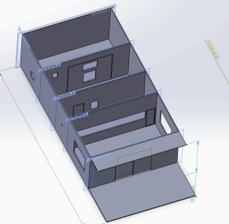

# Secure Vault  

Secure Vault is a security software designed for banks, focused on enhancing physical access protection to vaults and restricted areas through advanced technologies such as facial recognition, RFID readers, and motion detectors.  

## Main Features  

- **Advanced Access Control**: Uses facial recognition and access codes to validate user identity.  
- **Employee Management**: Restricted access through an RFID reader to authenticate authorized employees.  
- **Physical Security**: Motion detectors to alert about unauthorized intrusions.  
- **Hardware Integration**: Compatible with membrane keyboards, LCD screens, servomotors, and smoke sensors.  

## System Requirements  

### Hardware  
- **Microcontroller**: NodeMCU or ESP32.  
- **Peripherals**:  
  - Membrane keyboard.  
  - Servomotors for door control.  
  - RFID sensor (MFRC522).  
  - LCD screen.  
  - Motion sensor.  
  - Smoke sensor.  

### Software  
- **Development Environment**: Arduino IDE.  
- **Required Libraries**:  
  - `MFRC522.h` (for the RFID sensor).  
  - `Servo.h` (for the servomotors).  
  - `LiquidCrystal.h` (for the LCD screen).  

## Model Photos  

Here are some images of the Secure Vault model:

  
*Front view of the Secure Vault system.*

  
*Side view showcasing the hardware integration.*

  
*Internal view displaying the microcontroller and sensors.*

## Contact  

For more information or questions about the project, you can contact me:  
- **Name**: Héctor Tovar  
- **Email**: h.tovarm07@gmail.com  
- **LinkedIn**: [www.linkedin.com/in/hectortovarm](www.linkedin.com/in/hectortovarm)  
