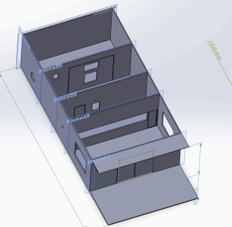
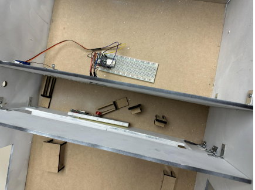
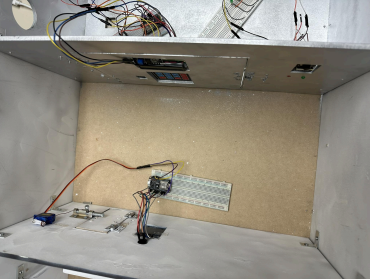
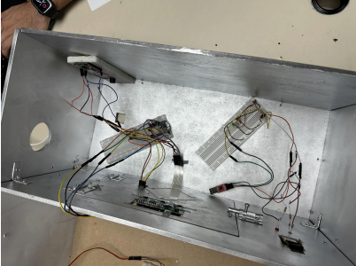

# Secure Vault  

Secure Vault is a security software designed for banks, focused on enhancing physical access protection to vaults and restricted areas through advanced technologies such as facial recognition, RFID readers, and motion detectors.  

## Main Features  

- **Advanced Access Control**: Uses facial recognition and access codes to validate user identity.  
- **Employee Management**: Restricted access through an RFID reader to authenticate authorized employees.  
- **Physical Security**: Motion detectors to alert about unauthorized intrusions.  
- **Hardware Integration**: Compatible with membrane keyboards, LCD screens, servomotors, and smoke sensors.  

## System Requirements  

### Hardware  
- **Microcontroller**: NodeMCU or ESP32.  
- **Peripherals**:  
  - Membrane keyboard.  
  - Servomotors for door control.  
  - RFID sensor (MFRC522).  
  - LCD screen.  
  - Motion sensor.  
  - Smoke sensor.  

### Software  
- **Development Environment**: Arduino IDE.  
- **Required Libraries**:  
  - `MFRC522.h` (for the RFID sensor).  
  - `Servo.h` (for the servomotors).  
  - `LiquidCrystal.h` (for the LCD screen).  

## Model Photos  

Here are some images of the Secure Vault model:

  
*3D model made in SolidWorks*  

The initial and main objective of this project was to provide greater security for banks.  
We chose different types of sensors, and the result we obtained was exactly as we expected.  

  
*Employee Area.*

There is an alert button that is activated when a bank employee notices an emergency, and this action results in a WhatsApp message requesting immediate help.

  
*File Area.*  

The RFID sensor uses cards that employees will have to enter the file room.  
If the card is valid, two short beeps will sound, and the door will open using the servomotor.  
If the card is invalid, a long beep will sound.  

  
*Vault Area.*  

Finally, we have the 3 sensors inside the vault: the facial sensor, which turns on a green LED when it detects a recognized face,  
and a red LED when it doesn't; a matrix keypad with its screen that detects whether the code is correct or incorrect; and a motion sensor that detects any forced entry into the vault.  
All these sensors send the following information to the same database: the registration number, the employee interacting with them, the area, the type of sensor, and the date with time.  
The combination of sensors and actuators, along with the database, will help develop indicators to further analyze employee behavior and even prevent potential attacks on the bank.  

## Website
[https://securevault.streamlit.app/](https://securevault.streamlit.app/)

## Contact  

For more information or questions about the project, you can contact me:  
- **Name**: Héctor Tovar  
- **Email**: h.tovarm07@gmail.com  
- **LinkedIn**: [www.linkedin.com/in/hectortovarm](www.linkedin.com/in/hectortovarm)
